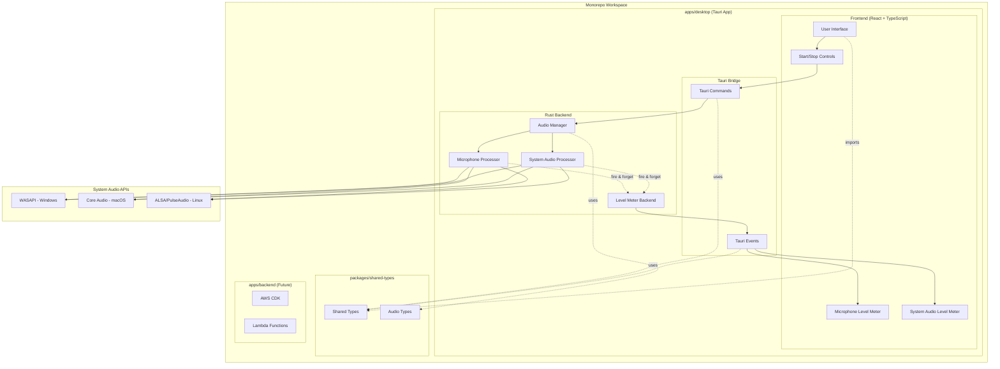

# Design Document: Audio Level Monitor

## Overview

The Audio Level Monitor is a Tauri-based desktop application organized within a monorepo workspace that provides real-time visual feedback of audio levels from both microphone input and system audio output. The system uses a hybrid architecture combining Rust backend for audio processing with a React frontend for user interface, ensuring cross-platform compatibility and optimal performance.

The monorepo structure enables shared type definitions between frontend and backend, unified tooling, and future scalability for additional applications and packages. The application follows a non-recording approach, processing audio streams only for level calculation and immediate display, with no persistent storage of audio data at this stage.

## Architecture

### Monorepo Workspace Structure

```
├── package.json              # Root package.json with workspace scripts
├── pnpm-workspace.yaml       # Workspace configuration
├── apps/
│   ├── desktop/              # Tauri desktop application (Rust)
│   │   ├── package.json      # Desktop app dependencies
│   │   └── tauri.conf.json   # Tauri configuration
│   ├── tauri-react/          # Web app for Tauri desktop
│   │   ├── src/              # Routes, components, utilities
│   │   ├── package.json      # Web app dependencies
│   │   └── vite.config.ts    # Vite configuration
│   └── backend/              # AWS CDK backend (future)
├── packages/
│   ├── shared-types/         # Shared TypeScript/Rust type definitions
│   │   ├── src/
│   │   │   ├── audio.ts      # Audio-related types
│   │   │   └── index.ts      # Type exports
│   │   └── package.json
│   └── ui/                   # Shared UI components (future)
└── .kiro/specs/              # Feature specifications
```

### High-Level Architecture



### Component Architecture

The system is organized into four main layers within the monorepo workspace:

1. **Presentation Layer (React)**: Located in `apps/desktop/src/`, handles user interface, level meter visualization, and user controls
2. **Application Layer (Tauri Commands/Events)**: Manages communication between frontend and backend using shared types
3. **Audio Processing Layer (Rust)**: Located in `apps/desktop/`, handles low-level audio capture, processing, and level calculation
4. **Shared Types Layer**: Located in `packages/shared-types/`, provides type definitions used across frontend and backend

## Components and Interfaces

### Frontend Components

#### AudioLevelMonitor (Main Component)
- **Purpose**: Root component managing overall application state
- **Props**: None (root component)
- **State**: 
  - `isMonitoring: boolean` - Current monitoring state
  - `microphoneLevel: number` - Current microphone audio level (0-100)
  - `systemAudioLevel: number` - Current system audio level (0-100)
- **Methods**:
  - `startMonitoring()` - Initiates audio monitoring
  - `stopMonitoring()` - Stops audio monitoring

#### LevelMeter Component
- **Purpose**: Visual representation of audio levels
- **Props**:
  - `level: number` - Audio level value (0-100)
  - `label: string` - Display label ("Microphone" or "System Audio")
  - `isActive: boolean` - Whether monitoring is active
- **Rendering**: Animated bar or circular meter with color coding

#### ControlPanel Component
- **Purpose**: Start/stop controls for audio monitoring
- **Props**:
  - `isMonitoring: boolean` - Current monitoring state
  - `onStart: () => void` - Start monitoring callback
  - `onStop: () => void` - Stop monitoring callback

### Backend Components (Rust)

#### AudioManager
- **Purpose**: Central coordinator for audio processing
- **Methods**:
  - `start_monitoring() -> Result<(), AudioError>` - Initialize audio capture
  - `stop_monitoring() -> Result<(), AudioError>` - Stop audio capture and cleanup
  - `get_microphone_level() -> f32` - Get current microphone level
  - `get_system_audio_level() -> f32` - Get current system audio level

#### MicrophoneProcessor
- **Purpose**: Handles microphone audio capture and processing
- **Methods**:
  - `initialize_device() -> Result<(), AudioError>` - Setup microphone device
  - `start_capture() -> Result<(), AudioError>` - Begin audio capture
  - `send_audio_chunk(buffer: &[f32])` - Send audio chunk to level meter backend (fire & forget)
  - `stop_capture()` - Stop microphone capture

#### SystemAudioProcessor
- **Purpose**: Handles system audio capture and processing
- **Methods**:
  - `initialize_loopback() -> Result<(), AudioError>` - Setup system audio loopback
  - `start_capture() -> Result<(), AudioError>` - Begin system audio capture
  - `send_audio_chunk(buffer: &[f32])` - Send audio chunk to level meter backend (fire & forget)
  - `stop_capture()` - Stop system audio capture

#### LevelMeterBackend
- **Purpose**: Unified backend for processing audio chunks and emitting level events
- **Methods**:
  - `process_audio_chunk(buffer: &[f32], source: AudioSource)` - Process chunk and emit level event
  - `calculate_rms_level(buffer: &[f32]) -> f32` - Calculate RMS audio level
  - `calculate_peak_level(buffer: &[f32]) -> f32` - Calculate peak audio level
  - `emit_level_event(level: f32, source: AudioSource)` - Emit level update event to frontend
  - `smooth_level(current: f32, previous: f32, smoothing_factor: f32) -> f32` - Apply smoothing

### Tauri Interface

#### Commands
```rust
#[tauri::command]
async fn start_audio_monitoring() -> Result<(), String>

#[tauri::command]
async fn stop_audio_monitoring() -> Result<(), String>

#[tauri::command]
async fn get_audio_levels() -> Result<AudioLevels, String>
```

#### Events
```rust
// Emitted when audio levels are calculated (fire & forget from processors)
struct AudioLevelUpdate {
    source: AudioSource,        // "mic" or "system_audio"
    level: f32,                // 0-100 range
    timestamp: u64,            // Unix timestamp
}

#[derive(Debug, Clone)]
enum AudioSource {
    Microphone,
    SystemAudio,
}
```

### Shared Types Package

The `packages/shared-types` package provides type definitions that are used across both the Rust backend and TypeScript frontend, ensuring type safety and consistency.

#### Package Structure
```
packages/shared-types/
├── src/
│   ├── audio.ts              # Audio-related type definitions
│   ├── events.ts             # Event type definitions
│   └── index.ts              # Main exports
├── package.json              # Package configuration
└── tsconfig.json             # TypeScript configuration
```

#### Type Definitions
```typescript
// packages/shared-types/src/audio.ts
export interface AudioLevelUpdate {
  source: 'mic' | 'system_audio';
  level: number;                   // 0-100 range
  timestamp: number;               // Unix timestamp
}

export type AudioSource = 'mic' | 'system_audio';

export interface AudioLevels {
  microphone: number;
  systemAudio: number;
}
```

#### Rust Type Generation
The shared types are also generated for Rust using `ts-rs` or similar tools to ensure consistency:

```rust
// Generated Rust types from TypeScript definitions
#[derive(Debug, Clone, Serialize, Deserialize, TS)]
#[ts(export)]
pub struct AudioLevelUpdate {
    pub source: AudioSource,
    pub level: f32,
    pub timestamp: u64,
}
```

## Data Models

### Shared Type Definitions

All data models are defined in the `packages/shared-types` package to ensure consistency between frontend and backend.

### AudioLevelUpdate
```typescript
// packages/shared-types/src/audio.ts
interface AudioLevelUpdate {
  source: 'mic' | 'system_audio';  // Audio source identifier
  level: number;                   // 0-100 range
  timestamp: number;               // Unix timestamp
}
```

### AudioLevels
```typescript
// packages/shared-types/src/audio.ts
interface AudioLevels {
  microphone: number;              // Current microphone level (0-100)
  systemAudio: number;             // Current system audio level (0-100)
}
```

### AudioChunk
```rust
#[derive(Debug, Clone)]
pub struct AudioChunk {
    pub buffer: Vec<f32>,
    pub source: AudioSource,
    pub sample_rate: u32,
    pub timestamp: u64,
}
```

### AudioError
```rust
#[derive(Debug, thiserror::Error)]
pub enum AudioError {
    #[error("Device not found: {0}")]
    DeviceNotFound(String),
    
    #[error("Permission denied: {0}")]
    PermissionDenied(String),
    
    #[error("Audio format not supported: {0}")]
    UnsupportedFormat(String),
    
    #[error("Audio stream error: {0}")]
    StreamError(String),
}
```

### MonitoringState
```rust
#[derive(Debug, Clone)]
pub struct MonitoringState {
    pub is_active: bool,
    pub microphone_device: Option<String>,
    pub system_audio_device: Option<String>,
    pub sample_rate: u32,
    pub buffer_size: u32,
}
```

## Correctness Properties

*A property is a characteristic or behavior that should hold true across all valid executions of a system-essentially, a formal statement about what the system should do. Properties serve as the bridge between human-readable specifications and machine-verifiable correctness guarantees.*

### Property 1: Audio capture initiation
*For any* audio monitoring session, when started, the system should initiate capture for both microphone input and system audio output
**Validates: Requirements 1.1, 2.1**

### Property 2: Audio processing pipeline
*For any* captured audio buffer from either source, the system should calculate corresponding audio level values and update the appropriate level meter display
**Validates: Requirements 1.2, 1.3, 2.2, 2.3**

### Property 3: Silent audio handling
*For any* silent audio input (microphone or system audio), the corresponding level meter should display zero or minimal activity
**Validates: Requirements 1.4, 2.4**

### Property 4: No persistent storage
*For any* audio data processed by the system, no audio content should be stored to disk or persisted beyond immediate level calculation
**Validates: Requirements 1.5, 2.5**

### Property 5: Peak level indication
*For any* audio level that exceeds normal ranges, the level meter should provide visual indication of peak levels
**Validates: Requirements 3.4**

### Property 6: State transition consistency
*For any* start or stop control activation, the processing state should transition appropriately and audio capture should start or stop accordingly
**Validates: Requirements 4.3, 4.4**

### Property 7: Stopped state display
*For any* stopped processing state, both level meter components should display inactive or zero states
**Validates: Requirements 4.5**

### Property 8: Error handling gracefully
*For any* unavailable audio device condition, the system should handle the error gracefully and notify the user
**Validates: Requirements 5.3**

### Property 9: Permission request handling
*For any* situation requiring audio permissions, the system should request appropriate system permissions
**Validates: Requirements 5.4**

### Property 10: Update frequency performance
*For any* active monitoring session, level meter displays should update at least 10 times per second
**Validates: Requirements 6.1**

### Property 11: Resource management
*For any* stopped processing state, all audio resources should be properly released
**Validates: Requirements 6.3**

### Property 12: Non-blocking audio processing
*For any* audio buffer processing operation, the user interface should remain responsive and not be blocked
**Validates: Requirements 6.4**

### Property 13: Workspace type consistency
*For any* type definition used across frontend and backend, the shared types package should ensure consistent type definitions between TypeScript and Rust
**Validates: Requirements 7.3**

## Error Handling

### Error Categories

1. **Device Errors**
   - Microphone not found or inaccessible
   - System audio loopback not available
   - Device disconnection during monitoring

2. **Permission Errors**
   - Microphone access denied
   - System audio access restricted

3. **Audio Format Errors**
   - Unsupported sample rates
   - Incompatible audio formats
   - Buffer size mismatches

4. **System Resource Errors**
   - Insufficient memory for audio buffers
   - CPU overload affecting audio processing
   - Audio driver conflicts

### Error Handling Strategy

- **Graceful Degradation**: When one audio source fails, continue monitoring the available source
- **User Notification**: Display clear error messages with actionable guidance
- **Automatic Recovery**: Attempt to reconnect to audio devices when they become available
- **Resource Cleanup**: Ensure proper cleanup of audio resources on any error condition

### Error Recovery Mechanisms

```rust
impl AudioManager {
    async fn handle_device_error(&mut self, error: AudioError) -> Result<(), AudioError> {
        match error {
            AudioError::DeviceNotFound(_) => {
                // Attempt to find alternative device
                self.find_alternative_device().await
            },
            AudioError::PermissionDenied(_) => {
                // Request permissions and retry
                self.request_permissions_and_retry().await
            },
            AudioError::StreamError(_) => {
                // Restart audio stream
                self.restart_audio_stream().await
            },
            _ => Err(error)
        }
    }
}
```

## Testing Strategy

### Dual Testing Approach

The testing strategy employs both unit tests and property-based tests to ensure comprehensive coverage:

- **Unit Tests**: Verify specific examples, edge cases, and error conditions
- **Property Tests**: Verify universal properties across all inputs using randomized testing

### Property-Based Testing Configuration

- **Testing Library**: `proptest` for Rust backend, `fast-check` for TypeScript frontend
- **Test Iterations**: Minimum 100 iterations per property test
- **Tag Format**: Each property test must include a comment: **Feature: audio-level-monitor, Property {number}: {property_text}**

### Unit Testing Focus Areas

1. **Audio Level Calculations**
   - RMS and peak level calculation accuracy
   - Edge cases: silent audio, clipped audio, various sample rates
   - Buffer size variations and boundary conditions

2. **State Management**
   - Start/stop transitions
   - Error state handling
   - Resource cleanup verification

3. **UI Component Behavior**
   - Level meter rendering with various input values
   - Control panel state synchronization
   - Error message display

4. **Cross-Platform Integration**
   - Platform-specific audio API integration
   - Device enumeration and selection
   - Permission handling per platform

### Property Testing Focus Areas

1. **Audio Processing Pipeline**
   - Invariant: Audio capture always leads to level calculation
   - Invariant: Level calculation always triggers UI update
   - Round-trip: Start then stop should return to initial state

2. **Resource Management**
   - Invariant: Stopped state always releases all resources
   - Invariant: No audio data persists beyond processing

3. **Performance Properties**
   - Invariant: UI updates maintain minimum 30 FPS
   - Invariant: Audio processing doesn't block UI thread

### Integration Testing

- **End-to-End Scenarios**: Complete monitoring sessions from start to stop
- **Device Simulation**: Mock audio devices for testing error conditions
- **Performance Testing**: CPU and memory usage under various loads
- **Cross-Platform Validation**: Automated testing on Windows, macOS, and Linux

### Test Data Generation

- **Audio Buffer Generation**: Synthetic audio data with controlled characteristics
- **Device State Simulation**: Mock device availability and permission states
- **Error Condition Injection**: Systematic testing of all error paths

<function_calls>
<invoke name="prework">
<parameter name="featureName">audio-level-monitor