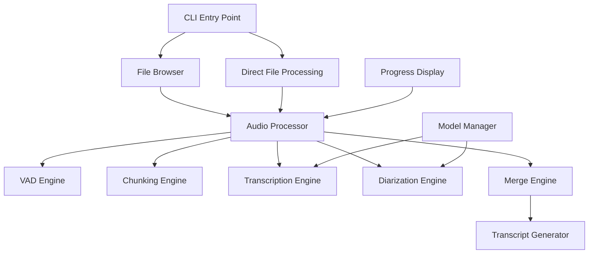
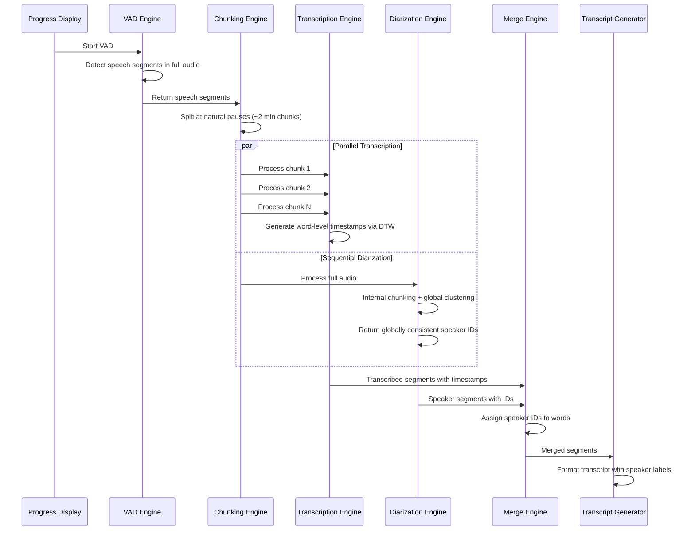

# Design Document: Audio Transcription CLI

## Overview

The Audio Transcription CLI is a Rust-based command-line application that provides high-performance audio transcription with speaker diarization. The system uses an interactive terminal interface for file selection and processes audio files through a sophisticated pipeline that combines parallel transcription with sequential speaker diarization to produce formatted transcripts with speaker labels.

The design prioritizes performance through parallel processing, native GPU acceleration, and efficient memory management while maintaining cross-platform compatibility without Python dependencies.

## Architecture

### High-Level Architecture



### Processing Pipeline

The core processing pipeline is optimized based on performance characteristics where transcription is the bottleneck (3-10 minutes for 1 hour on GPU) while diarization is fast (1.5 minutes for 1 hour on GPU):



### Technology Stack

- **Language**: Rust for performance and native Metal/GPU acceleration
- **Transcription**: `whisper-rs` (Rust bindings to whisper.cpp)
  - Enables Metal acceleration on macOS without Python dependencies
  - Built-in DTW for word-level timestamps
  - Built-in VAD capabilities
- **Speaker Diarization**: `pyannote-rs` (Rust port of pyannote-audio)
  - Uses ONNX runtime for inference
  - Supports CoreML on macOS, DirectML on Windows
  - Handles internal chunking with sliding windows and global clustering
- **CLI Framework**: `crossterm` for interactive terminal UI
- **Parallel Processing**: `rayon` for CPU parallelization
- **Audio Processing**: `symphonia` for format decoding, `hound` for WAV handling

## Components and Interfaces

### File Browser Component

```rust
pub struct FileBrowser {
    current_path: PathBuf,
    entries: Vec<DirectoryEntry>,
    selected_index: usize,
}

pub enum DirectoryEntry {
    Directory { name: String },
    AudioFile { name: String, size: u64 },
    Parent,
}

impl FileBrowser {
    pub fn new(path: PathBuf) -> Result<Self>;
    pub fn navigate_to(&mut self, path: PathBuf) -> Result<()>;
    pub fn get_selected(&self) -> Option<&DirectoryEntry>;
    pub fn move_selection(&mut self, direction: Direction);
    pub fn render(&self) -> String;
}
```

### Audio Processor Component

```rust
pub struct AudioProcessor {
    model_manager: ModelManager,
    config: ProcessingConfig,
}

pub struct ProcessingConfig {
    pub model_size: ModelSize,
    pub chunk_duration: f32,
    pub parallel_jobs: usize,
    pub use_gpu: bool,
}

impl AudioProcessor {
    pub async fn process_file(&self, path: &Path) -> Result<TranscriptResult>;
    fn run_vad(&self, audio: &[f32]) -> Result<Vec<VadSegment>>;
    fn create_chunks(&self, audio: &[f32], vad_segments: &[VadSegment]) -> Vec<AudioChunk>;
    async fn transcribe_parallel(&self, chunks: Vec<AudioChunk>) -> Result<Vec<SpeechSegment>>;
    async fn run_diarization(&self, audio: &[f32]) -> Result<Vec<DiarizationSegment>>;
    fn merge_results(&self, transcript: Vec<SpeechSegment>, diarization: Vec<DiarizationSegment>) -> Vec<SpeechSegment>;
}
```

### Model Manager Component

```rust
pub struct ModelManager {
    cache_dir: PathBuf,
    whisper_model: Option<WhisperModel>,
    pyannote_model: Option<PyannoteModel>,
}

impl ModelManager {
    pub fn new() -> Result<Self>;
    pub async fn ensure_models(&mut self, model_size: ModelSize) -> Result<()>;
    pub async fn download_model(&self, model_type: ModelType, size: ModelSize) -> Result<()>;
    pub fn get_whisper_model(&self) -> Result<&WhisperModel>;
    pub fn get_pyannote_model(&self) -> Result<&PyannoteModel>;
}
```

### Progress Display Component

```rust
pub struct ProgressDisplay {
    current_stage: ProcessingStage,
    total_chunks: usize,
    completed_chunks: usize,
    start_time: Instant,
}

pub enum ProcessingStage {
    VAD,
    Chunking,
    Transcription,
    Diarization,
    Merging,
    Complete,
}

impl ProgressDisplay {
    pub fn new() -> Self;
    pub fn set_stage(&mut self, stage: ProcessingStage);
    pub fn update_progress(&mut self, completed: usize, total: usize);
    pub fn render(&self) -> String;
}
```

## Data Models

### Core Data Structures

```rust
/// A segment of speech with timing and optional speaker
#[derive(Debug, Clone)]
pub struct SpeechSegment {
    pub start: f32,           // Start time in seconds
    pub end: f32,             // End time in seconds
    pub text: String,         // Transcribed text
    pub speaker: Option<u8>,  // Speaker ID (assigned after diarization)
}

/// A chunk of audio to be processed
#[derive(Debug)]
pub struct AudioChunk {
    pub index: usize,
    pub start: f32,
    pub end: f32,
    pub samples: Vec<f32>,    // 16kHz mono samples
}

/// Result from voice activity detection
#[derive(Debug, Clone)]
pub struct VadSegment {
    pub start: f32,
    pub end: f32,
    pub confidence: f32,
}

/// Result from speaker diarization
#[derive(Debug, Clone)]
pub struct DiarizationSegment {
    pub start: f32,
    pub end: f32,
    pub speaker: u8,
}

/// Final transcript result
#[derive(Debug)]
pub struct TranscriptResult {
    pub segments: Vec<SpeechSegment>,
    pub processing_time: Duration,
    pub model_info: ModelInfo,
}
```

### Algorithm Specifications

#### Chunking Algorithm

```rust
fn create_chunks(
    audio: &[f32],
    speech_segments: &[VadSegment],
    target_duration: f32,    // ~120 seconds
    min_silence_gap: f32,    // ~0.5 seconds
    sample_rate: f32,        // 16000 Hz
) -> Vec<AudioChunk> {
    let mut chunks = Vec::new();
    let mut current_start = 0.0;
    let mut accumulated_duration = 0.0;
    
    for segment in speech_segments {
        let segment_duration = segment.end - segment.start;
        
        // Check if adding this segment would exceed target duration
        if accumulated_duration + segment_duration > target_duration {
            // Look for a silence gap to split
            if let Some(split_point) = find_silence_gap(segment, min_silence_gap) {
                // Create chunk up to split point
                chunks.push(create_chunk_from_range(audio, current_start, split_point, sample_rate));
                current_start = split_point;
                accumulated_duration = segment.end - split_point;
            }
        } else {
            accumulated_duration += segment_duration;
        }
    }
    
    // Add final chunk if any audio remains
    if accumulated_duration > 0.0 {
        chunks.push(create_chunk_from_range(audio, current_start, speech_segments.last().unwrap().end, sample_rate));
    }
    
    chunks
}
```

#### Speaker Assignment Algorithm

```rust
fn assign_speakers(
    transcript: &mut [SpeechSegment],
    diarization: &[DiarizationSegment],
) {
    for segment in transcript {
        // Use segment midpoint for assignment to handle edge cases
        let midpoint = (segment.start + segment.end) / 2.0;
        
        segment.speaker = diarization
            .iter()
            .find(|d| d.start <= midpoint && midpoint <= d.end)
            .map(|d| d.speaker);
    }
}
```

Now I need to use the prework tool to analyze the acceptance criteria before writing the Correctness Properties section:

<function_calls>
<invoke name="prework">
<parameter name="featureName">audio-transcription-cli

## Correctness Properties

*A property is a characteristic or behavior that should hold true across all valid executions of a system—essentially, a formal statement about what the system should do. Properties serve as the bridge between human-readable specifications and machine-verifiable correctness guarantees.*

Based on the prework analysis, I've identified the following testable properties while eliminating redundant ones through property reflection:

### Property 1: Directory Display Formatting
*For any* directory structure, when displaying contents, all folders should have "[DIR]" prefix and all audio files should display with their file sizes
**Validates: Requirements 1.2**

### Property 2: File Browser Navigation Consistency
*For any* valid directory path, navigating into a directory and then selecting ".." should return to the original directory
**Validates: Requirements 1.4, 1.5**

### Property 3: Audio Format Filtering
*For any* directory containing mixed file types, when audio format filtering is enabled, only directories and supported audio formats (.wav, .mp3, .m4a, .flac, .ogg, .webm) should be displayed
**Validates: Requirements 1.6**

### Property 4: Audio Resampling Consistency
*For any* supported audio file, when processed by the Audio_Processor, the output should always be resampled to 16kHz mono format regardless of input format
**Validates: Requirements 2.1**

### Property 5: Chunking Duration Bounds
*For any* audio file with detected speech segments, created chunks should target approximately 2 minutes duration and split only at natural pauses of 0.5 seconds or greater
**Validates: Requirements 2.3**

### Property 6: Parallel Processing Utilization
*For any* audio file requiring multiple chunks, transcription should utilize multiple CPU cores concurrently during chunk processing
**Validates: Requirements 2.4, 6.1**

### Property 7: Speaker Assignment Consistency
*For any* transcribed segment and corresponding diarization data, speaker IDs should be assigned based on temporal overlap between transcription and diarization segments
**Validates: Requirements 2.6**

### Property 8: Output File Naming
*For any* input audio file, the generated transcript file should have the same base name with a .txt extension
**Validates: Requirements 4.1**

### Property 9: Speaker Label Formatting
*For any* transcript with speaker information, all speaker labels should follow the format "[SPEAKER_XX]" where XX is a zero-padded two-digit number
**Validates: Requirements 4.2**

### Property 10: Speaker Transition Formatting
*For any* transcript with multiple speakers, when the speaker changes, a new speaker label should be printed with an empty line for readability, and consecutive sentences from the same speaker should be grouped without repeating labels
**Validates: Requirements 4.3, 4.4, 4.5**

### Property 11: Text Preservation
*For any* transcribed text, the Transcript_Generator should preserve all punctuation and capitalization from the original transcription without modification
**Validates: Requirements 4.6**

### Property 12: Model Storage Location
*For any* downloaded model, it should be stored in the platform-specific cache directory (~/.cache/audio-transcribe/models/ on Unix-like systems)
**Validates: Requirements 5.4**

### Property 13: Command-Line Model Selection
*For any* valid model size specified via --model flag (tiny, base, small, medium, large), the Model_Manager should use the specified model for processing
**Validates: Requirements 5.5, 9.1**

### Property 14: Memory Management Efficiency
*For any* audio file processed in chunks, memory usage should not grow linearly with audio length, and processed chunks should be released from memory
**Validates: Requirements 6.4, 7.2, 7.3**

### Property 15: Command-Line Configuration
*For any* valid command-line flags (--output, --jobs, --chunk-size, --no-gpu), the CLI should apply the specified configuration to the processing pipeline
**Validates: Requirements 9.2, 9.3, 9.4, 9.5**

## Error Handling

The system implements comprehensive error handling across all components:

### Model Management Errors
- **Missing Models**: When required models are not found in cache, prompt user for download confirmation
- **Download Failures**: Display clear error messages and exit gracefully when model downloads fail
- **Corrupted Models**: Detect and re-download corrupted model files

### Audio Processing Errors
- **Unsupported Formats**: Display error message and return to file browser for unsupported audio formats
- **Corrupted Audio**: Skip corrupted files with error message without crashing the application
- **Memory Constraints**: Suggest smaller model or fewer parallel jobs when insufficient memory is detected

### System Resource Errors
- **GPU Unavailable**: Fall back to CPU processing with warning when GPU acceleration is requested but unavailable
- **Insufficient Disk Space**: Check available space before downloading models or writing output files
- **Permission Errors**: Handle file system permission issues gracefully with informative error messages

### Error Recovery Strategies
- **Graceful Degradation**: Continue processing with reduced capabilities when non-critical components fail
- **User Guidance**: Provide actionable error messages that guide users toward resolution
- **State Preservation**: Maintain application state and return to file browser after recoverable errors

## Testing Strategy

The testing strategy employs a dual approach combining unit tests for specific examples and edge cases with property-based tests for universal correctness validation.

### Property-Based Testing Configuration

**Framework**: `proptest` crate for Rust property-based testing
**Test Configuration**: Minimum 100 iterations per property test to ensure comprehensive input coverage
**Test Tagging**: Each property test must reference its design document property using the format:
```rust
// Feature: audio-transcription-cli, Property N: [Property Title]
```

### Unit Testing Strategy

**Focus Areas**:
- Specific examples demonstrating correct behavior
- Edge cases and boundary conditions
- Error handling scenarios
- Integration points between components

**Test Organization**:
- Co-locate tests with source files using `.rs` files in `tests/` modules
- Separate integration tests in `tests/` directory
- Mock external dependencies (file system, network) for isolated testing

### Testing Coverage

**Core Algorithm Testing**:
- Chunking algorithm with various speech patterns and silence distributions
- Speaker assignment with overlapping, adjacent, and gapped segments
- Audio resampling with different input formats and sample rates
- File browser navigation with complex directory structures

**Error Condition Testing**:
- Model download failures and recovery
- Corrupted audio file handling
- Memory constraint simulation
- GPU availability detection and fallback

**Performance Testing**:
- Memory usage profiling during chunk processing
- Parallel processing verification
- Progress tracking accuracy

**Integration Testing**:
- End-to-end processing with sample audio files
- Command-line argument parsing and application
- Cross-platform compatibility verification

### Test Data Management

**Audio Test Files**:
- Short samples (5-30 seconds) for unit tests
- Longer samples (2-5 minutes) for integration tests
- Various formats and quality levels
- Known speaker patterns for diarization validation

**Generated Test Data**:
- Property-based test generators for directory structures
- Random audio segment generators for algorithm testing
- Synthetic speaker diarization data for merge testing